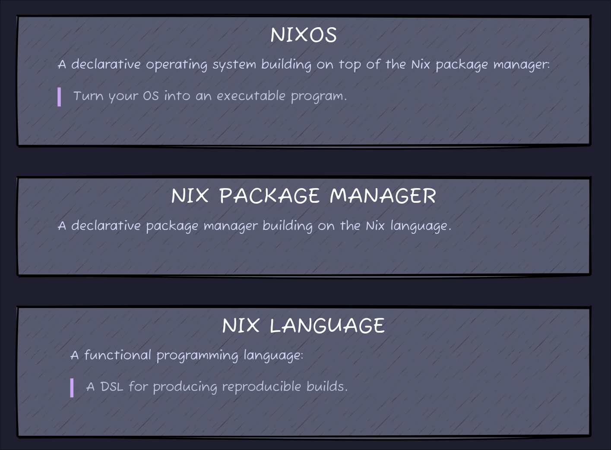
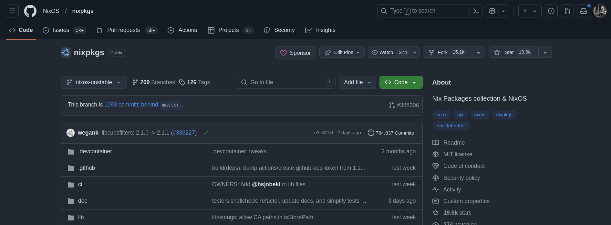
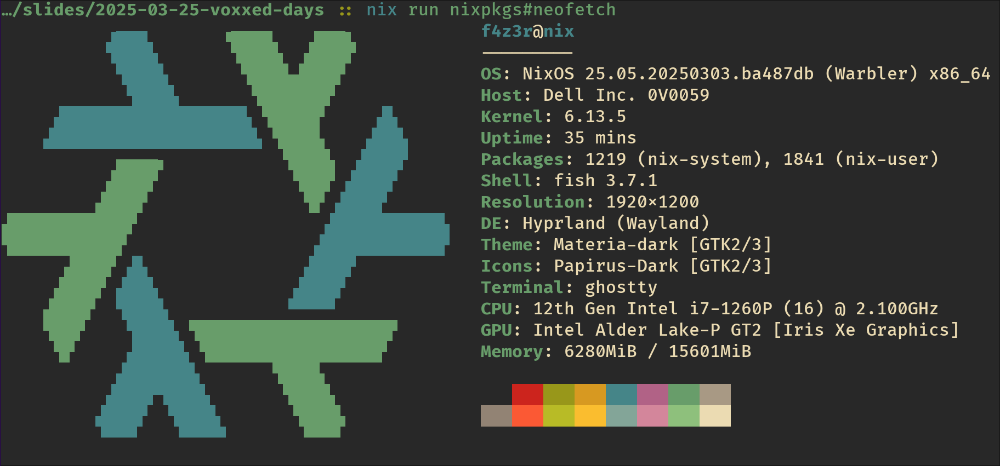

Nix Trinity
===



<!--
speaker_note: |
  3 MINUTES

  XXX: Extend to 4 minutes with intro story?

  Nix Lang:
  - functional
  - focused on building software
  - terrible documentation
  - terrible error messages

  Nix Pkgs:
  - registry of build definitions
  - simple github repository

  NixOS:
  - definition of a system
  - based on expressions of the nix language
  - using packages from nixpkgs
-->

Nix Language
===

# Expressions

```nix +line_numbers
let
  x = 1;
in
  {
    a = {
      b = true;
    };
    d.e.f = "hello";
    y = x;
    config = builtins.readFile ./config.ini;
  }
```

<!--
speaker_note: |
  1 MINUTES (4)

  - simple primitive types
  - everything is an expression
  - nothing too fancy
-->

Nix Language
===

# Derivations

<!-- column_layout: [3, 5] -->

<!-- column: 0 -->
<!-- newlines: 1 -->

## Context

- Definition of a package
- Fully reproducible

<!-- newlines: 1 -->

## Content

- A single closure
- Source code
- Build dependencies
- Runtime dependencies

<!-- newlines: 1 -->

## Support

- Using library functions for better abstractions
- Most standard builders are supported

<!-- column: 1 -->

```nix {1-17|1|2-3|5-10|9|12-14} +line_numbers
rustPlatform.buildRustPackage rec {
  pname = "presenterm";
  version = "0.10.1";

  src = fetchFromGitHub {
    owner = "mfontanini";
    repo = "presenterm";
    tag = "v${version}";
    hash = "sha256-...06HsX28mLvTrWh5yIbo/a54M=";
  };

  buildInputs = [
    libsixel
  ];

  # ...
}
```

<!-- reset_layout -->

<!--
speaker_note: |
  3 MINUTES (7)

  - rust based example
  - takes inputs and produces single output
  - every input hashed
-->

Nix Package Manager
===

# Nix Store

``` +line_numbers
/nix/store/sm724q6cyqwwghbadxssw9v2xyns56yn-python3-3.11.9
/nix/store/zr51xbkmmkflpp1nm433vfgpkndhp64d-python3-3.11.9
```

# Package Registry



<!--
speaker_note: |
  2 MINUTES (9)

  - presents output of a derivation
  - also hashed
-->

NixOS
===



<!-- newlines: 2 -->

<!-- column_layout: [1, 1] -->

<!-- column: 0 -->
- Entire OS managed by Nix
- Fully reproducible
- Only data not replicated

<!-- column: 1 -->
> https://github.com/f4z3r/nix

<!-- reset_layout -->

<!--
speaker_note: |
  2 MINUTES (11)

  - definition of a program which is your system
  - contains packages, and their config
  - check out my system definition
-->

Use Cases
===

## Dev Environments

- Pin tooling
- Ensure consistency
- Use abstractions: [DevBox](https://www.jetify.com/devbox)

## CI/CD

- Define pipelines as code
- Run locally

## Fleet Management

- Server management
- Replacement for pre-built ISOs / Packer

<!--
speaker_note: |
  3 MINUTES (14)

  Dev environments:
  - everyone has the same tool versions
  - ... and the same config
  - Nix is hard, use devbox

  CI/CD:
  - build pipelines in Nix
  - can run nix build everywhere
  - no more need for specialised runners

  Fleet Management:
  - large fleets
  - system lifecycles
  - pushing configuration changes
-->

Use Case: DevBox
===

```json {2-6,9-12} +line_numbers
{
  "packages": [
    "python312Packages.presenterm-export@0.2.7",
    "presenterm@0.10.1",
    "d2@0.6.9"
  ],
  "shell": {
    "scripts": {
      "build": [
        "d2 assets/*.d2",
        "presenterm -e slides.md"
      ],
      "present": [
        "presenterm --publish-speaker-notes slides.md"
      ]
    }
  }
}
```

<!--
speaker_note: |
  2 MINUTES (16)

  - no need to learn nix lang
  - simple version searches
  - pins versions in lock file
  - define simple build scripts

  Questions: 1-2 MINUTES
-->

Demo
===

# Nix REPL
## Loading Package Registry
## Exploration
## Building Packages
### Python with Various Dependencies
## Running Stuff

<!--
speaker_note: |
  5 MINUTES (21)

  nix repl

  <nixpkgs> # compare with channels/registry
  python3
  :l <nixpkgs>
  python3
  python3.withPackages # function
  python3.withPackages (p: [p.numpy])
  python3.withPackages (p: [p.jupyter])
  :b python3.withPackages (p: [p.numpy])

  Execute the binary and check imports ...
-->


<!-- vim:tw=60
-->
