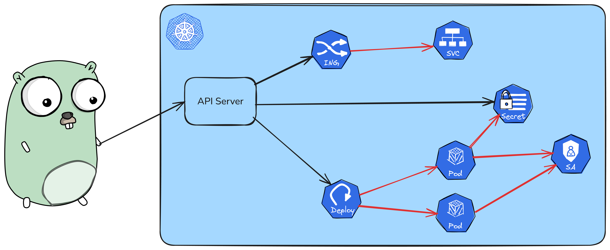
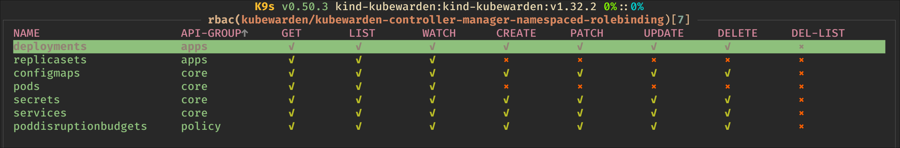
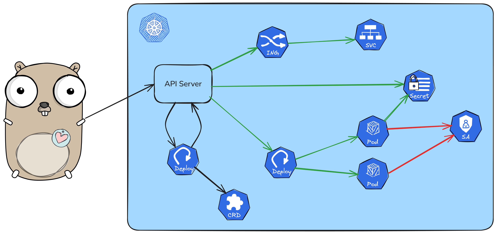
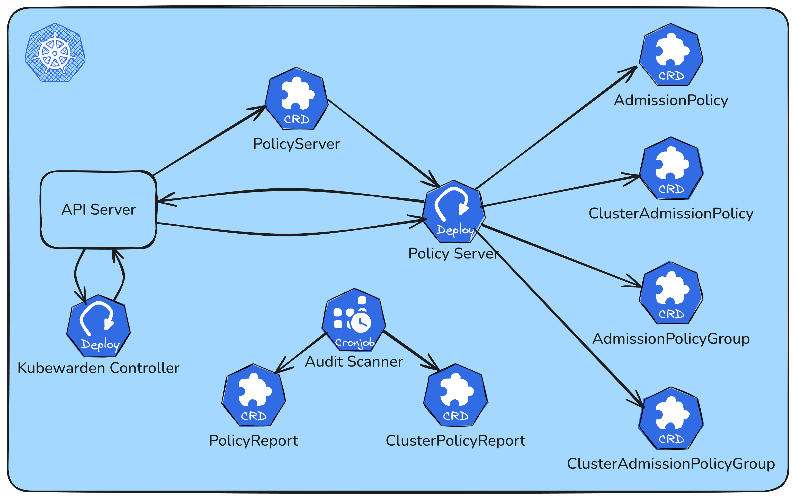
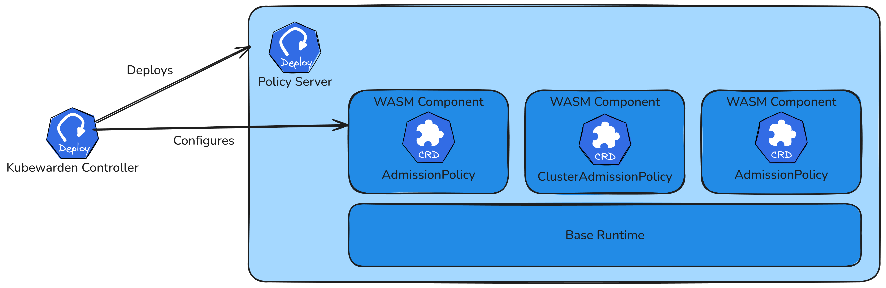

# Policy Engines {.center .uppercase}

## RBAC



## RBAC

:::{.center-items}

:::

::::::{.columns}
:::{.column .boxed width=50%}
#### Uses:
- `ServiceAccount`, `User`, `Group`
- `Role`, `ClusterRole`
- `RoleBinding`, `ClusterRoleBinding`
:::

:::{.column .boxed width=50%}
#### Limitations:
- Only applied to CRUD operations
- Does not check content
- Only supports basic allow/deny
:::
::::::

## Sample Role Definition

::: {.v-center-container-on-slide style="height: 80vh;"}
```{.yaml include="./assets/role.yaml" .numberLines}
```
:::

# Policy Engine {data-auto-animate=true}



# Policy Engine {data-auto-animate=true}

::::::::::::{.v-center-container-on-slide style="height: 80vh;"}
::::::{.columns}
:::{.column width=50%}

:::

:::{.column .v-center-items width=50%}
- Enabled via **Dynamic Access Control**
- Operator + validating admission webhook
- Access controlled via **Custom Resources**
- Often supports **mutations**
- Works **on top of RBAC**
:::
::::::
::::::::::::

## Use Cases

::::::{.columns}
:::{.column width=50%}
### Access Control
- More **granular** control on CRUD operations
- Control resource **internals**

### FinOps
- Block if **cost impact** too high
- Provide cost **estimation** on apply
:::

:::{.column width=50%}
### Compliance
* Control of **usage** of resources
* **Warn** on non-compliant operations
* **Mutate** resources as needed
:::
::::::

&nbsp;

```console
$ kubectl apply -f deployment.yaml
Error from server (Forbidden): error when creating "deployment.yaml": admission webhook
"validation.gatekeeper.sh" denied the request:
[monthly-cpu-cost-limit]: Deployment-blocked: Predicted monthly CPU cost $7290.0 exceeds limit $5000.0
Current usage: $6.37/hours ($4590.0/month) using 5.9 cores (based on 13.50 hours of data)
New deployment: 3 (3.0 cores) will cost $2700.0/month
Total predicted: $7290.0/month (Rate: $1.25 per core hour)
```

## Implementations {data-auto-animate=true}

::::::{.columns}
::::{.column width=33%}
:::{.center-items}
{width=57%}
:::

### Kyverno

- Most Mature
- Nice exception handling
- Does more than access
::::

::::{.column width=33%}
:::{.center-items}
{width=70%}
:::

### Kubewarden

- Most flexible
- Actual policy-as-code
- Complex
:::

::::{.column width=33%}
:::{.center-items}
{width=57%}
:::

### Gatekeeper

- Best integration with OPA
- No mutations
:::
::::::

# {.center data-auto-animate=true}


## Architecture

:::{.v-center-container-on-slide style="height: 80vh;"}
{height=1200px}
:::

## Policy Server

:::{.v-center-container-on-slide style="height: 80vh;"}

:::

## Custom Resource {data-auto-animate=true}

<pre data-id="code-animation"><code data-trim data-line-numbers="|5-6" class="language-yaml">
apiVersion: policies.kubewarden.io/v1
kind: ClusterAdmissionPolicy
metadata:
  annotations:
    io.kubewarden.policy.category: PSP
    io.kubewarden.policy.severity: medium
  name: privileged-pods
</code></pre>

## Custom Resource {data-auto-animate=true}

<pre data-id="code-animation"><code data-trim data-line-numbers="|6-7" class="language-yaml">
apiVersion: policies.kubewarden.io/v1
kind: ClusterAdmissionPolicy
metadata:
  name: privileged-pods
spec:
  module: registry://ghcr.io/kubewarden/policies/pod-privileged:v1.0.0
  settings: {}
</code></pre>

## Custom Resource {data-auto-animate=true}

<pre data-id="code-animation"><code data-trim data-line-numbers="8-11" class="language-yaml">
apiVersion: policies.kubewarden.io/v1
kind: ClusterAdmissionPolicy
metadata:
  name: privileged-pods
spec:
  module: registry://ghcr.io/kubewarden/policies/pod-privileged:v1.0.0
  settings: {}
  backgroundAudit: true
  mode: protect
  mutating: false
  policyServer: default
</code></pre>

## Custom Resource {data-auto-animate=true}

<pre data-id="code-animation"><code data-trim data-line-numbers="12-18|19" class="language-yaml">
apiVersion: policies.kubewarden.io/v1
kind: ClusterAdmissionPolicy
metadata:
  name: privileged-pods
spec:
  module: registry://ghcr.io/kubewarden/policies/pod-privileged:v1.0.0
  settings: {}
  backgroundAudit: true
  mode: protect
  mutating: false
  policyServer: default
  rules:
    - apiGroups: [""]
      apiVersions: [v1]
      operations:
        - CREATE
        - UPDATE
      resources: [pods]
  timeoutSeconds: 10
</code></pre>

# {.center}

[https://github.com/iptch/kubewarden-demo](https://github.com/iptch/kubewarden-demo){.xx-large}

## Verdict {.uppercase}

::::::{.columns}
:::{.column .boxed width=50%}
#### Pros:
- Immense flexibility
- Extremely fast policy evaluation
- Can be adopted slowly
:::

:::{.column .boxed width=50%}
#### Cons:
- Complex
- Not as established as Kyverno
- More difficult to get support
:::
::::::
