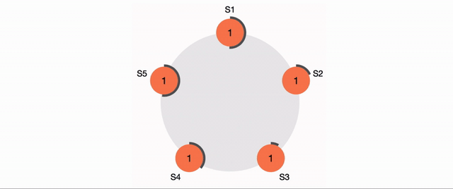
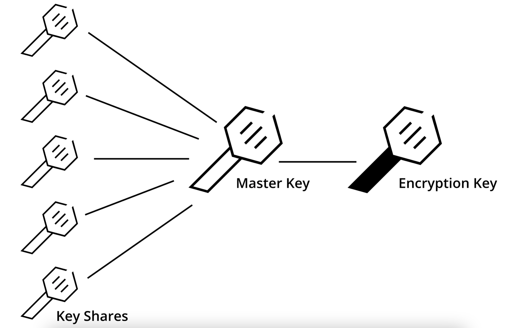
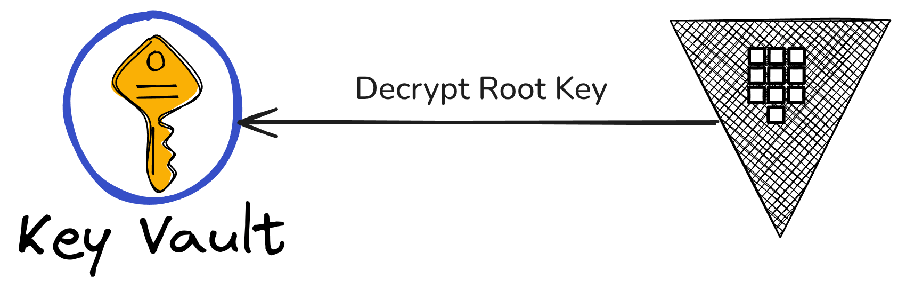

<!--
speaker_note: |
  - increase font size 5 times with ctrl-+
-->


Architecture
===


Consul
===

<!-- new_lines: 5 -->

|                     | Integrated Storage                                | Consul                                             |
| -                   | -                                                 | -                                                  |
| Deployment          | Vault cluster is all you need.                    | Vault cluster & Dedicated Consul cluster.          |
| Data location       | Data is on disk.                                  | All data is in memory.                             |
| System requirements | System requirements                               | System requirements                                |
| Snapshots           | Normal data backup strategy of your organization. | Frequent snapshots are necessary (data in memory). |
| Max message size    | 1 MiB (the max_entry_size parameter)              | 512 KiB (kv_max_value_size parameter)              |

Leader Election: Raft
===




<!-- alignment: center -->
[Raft Demo](https://raft.github.io/)

<!-- end_slide -->
<!-- jump_to_middle -->
<!-- font_size: 4 -->
Seals
===

Seals: Shamir
===

<!-- new_lines: 3 -->



Seals
===

```bash +exec
vault server -config assets/config.hcl
```

Seals: Initialise Backend
===

```bash +exec
export VAULT_ADDR="http://127.0.0.1:8200"
vault operator init \
    -key-shares=3 \
    -key-threshold=2 \
    -format=json | tee assets/vault/keys.json
```

Seals: Login
===

```bash +exec
export VAULT_ADDR="http://127.0.0.1:8200"
vault login "$(jq -r '.root_token' < assets/vault/keys.json)"
```

Seals: Unsealing
===

```bash +exec
export VAULT_ADDR="http://127.0.0.1:8200"
vault operator unseal "$(jq -r '.unseal_keys_b64[0]' < assets/vault/keys.json)"
```

Seals: Unsealing
===

```bash +exec
export VAULT_ADDR="http://127.0.0.1:8200"
vault operator unseal "$(jq -r '.unseal_keys_b64[1]' < assets/vault/keys.json)"
```

Seals: Login
===

```bash +exec
export VAULT_ADDR="http://127.0.0.1:8200"
vault login "$(jq -r '.root_token' < assets/vault/keys.json)"
```

Seals: Auto-Unseal
===

<!-- new_lines: 5 -->



Hands-On
===

<!-- new_lines: 5 -->
<!-- column_layout: [1, 2, 1] -->

<!-- column: 1 -->
<!-- font_size: 2 -->
We will cover:
- Auth Methods
- Secret Engines
- Operational Tasks

<!-- reset_layout -->

Hands-On
===

<!-- new_lines: 4 -->
<!-- alignment: center -->


<!-- new_lines: 2 -->
<!-- font_size: 2 -->
https://github.com/f4z3r/vault-workshop
