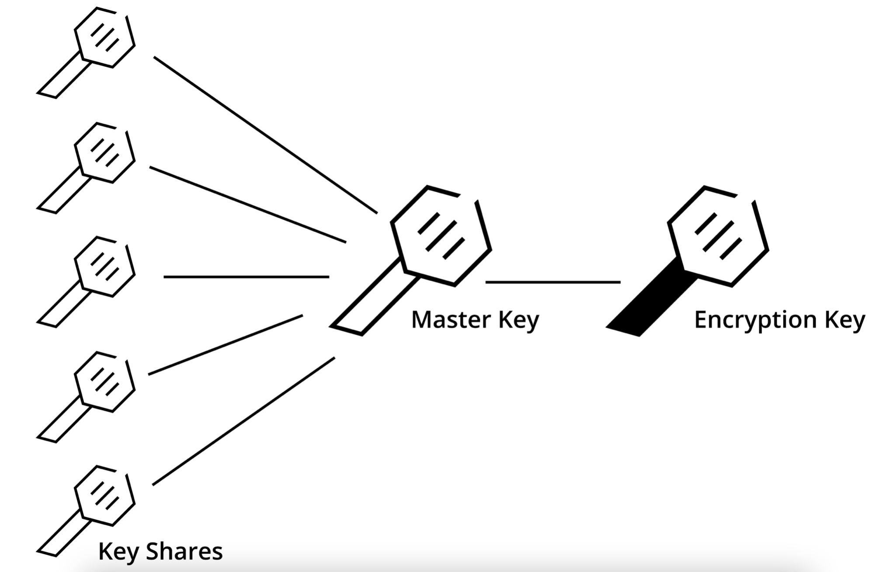

<!--
speaker_note: |
  - increase font size 4 times with ctrl-+
-->

Preparation
===

```bash
docker pull ghcr.io/f4z3r/vault-workshop:v0.0.8
```

Use Cases
===

<!-- font_size: 2 -->

## Functional:

- Storage
- Dynamic Access
- Timeboxed Access
- Encryption

## Non-Functional:

- Full automation support
- HA and disaster recovery
- Centralized capabilities
- No cloud lock-in

Architecture
===


<!-- end_slide -->
<!-- jump_to_middle -->
<!-- font_size: 4 -->
Seals
===

Seals: Shamir
===

<!-- new_lines: 3 -->



Seals
===

```bash +exec
vault server -config assets/config.hcl
```

Seals: Initialise Backend
===

```bash +exec
export VAULT_ADDR="http://127.0.0.1:8200"
vault operator init \
    -key-shares=3 \
    -key-threshold=2 \
    -format=json | tee assets/vault/keys.json
```

Seals: Login
===

```bash +exec
export VAULT_ADDR="http://127.0.0.1:8200"
vault login "$(jq -r '.root_token' < assets/vault/keys.json)"
```

Seals: Unsealing
===

```bash +exec
export VAULT_ADDR="http://127.0.0.1:8200"
vault operator unseal "$(jq -r '.unseal_keys_b64[0]' < assets/vault/keys.json)"
```

Seals: Unsealing
===

```bash +exec
export VAULT_ADDR="http://127.0.0.1:8200"
vault operator unseal "$(jq -r '.unseal_keys_b64[1]' < assets/vault/keys.json)"
```

Seals: Login
===

```bash +exec
export VAULT_ADDR="http://127.0.0.1:8200"
vault login "$(jq -r '.root_token' < assets/vault/keys.json)"
```

Leader Election: Raft
===


<!-- alignment: center -->
[Raft Demo](https://raft.github.io/)

Log Replication: Raft
===

<!-- new_lines: 4 -->
<!-- alignment: center -->
<!-- font_size: 2 -->
https://thesecretlivesofdata.com/raft/

Hands-On
===

<!-- new_lines: 5 -->
<!-- column_layout: [1, 2, 1] -->

<!-- column: 1 -->
<!-- font_size: 2 -->
We will cover:
- Auth Methods
- Secret Engines
- Operational Tasks

<!-- reset_layout -->

Hands-On
===

<!-- new_lines: 4 -->
<!-- alignment: center -->


<!-- new_lines: 2 -->
<!-- font_size: 2 -->
https://github.com/f4z3r/vault-workshop
