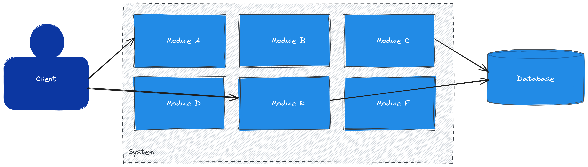
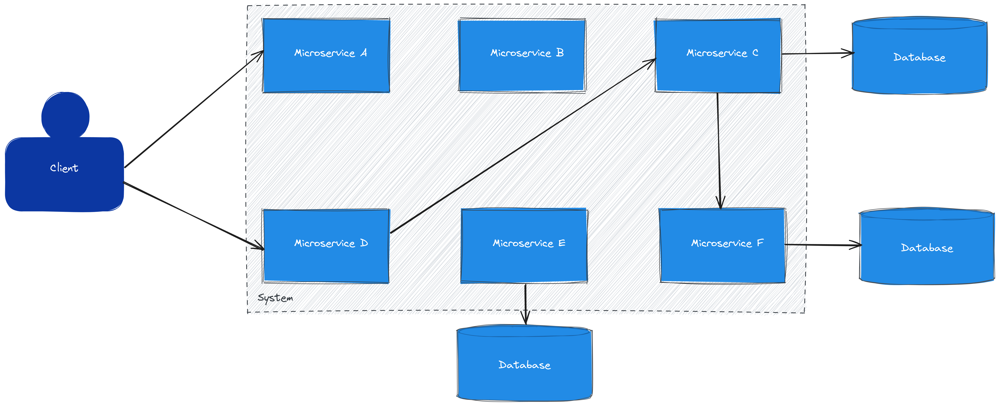
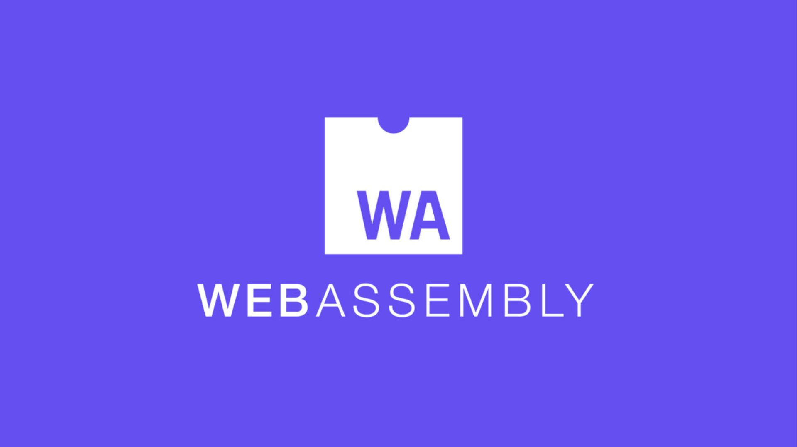
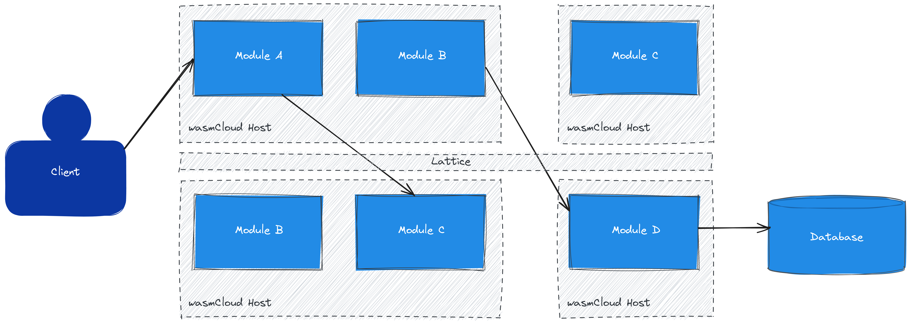

<!-- jump_to_middle -->
<!-- font_size: 2 -->
The Evolution of Architecture
===

<!--
speaker_note: |
  - Architectural background why Kubernetes came to be
-->

<!-- end_slide -->
Modular Monoliths
===

<!--
speaker_note: |
  - Complexity:
      - High entry barrier: Large code base
      - Single language: Usually one language for all functionalities
      - Upgrades are high risk: tech debt (everything needs to be redeployed)

  - Deployment:
      - Big releases: No individual deployment -> full rebuild
      - Large artifact: Extended downtime during deployment
      - Slow cycles: Reduced iteration speed

  - Operation:
      - Shared state: Difficult debugging
      - Tight coupling: High blast radius
      - Inflexible scaling: Resource waste
-->

<!-- end_slide -->
Microservices
===

<!--
speaker_note: |
  - Autonomy:
      + Independent deployment: Reduced blast radius and smaller release cycles
      + Decentralized data: Each microservice is responsible for its own data
      + Polyglot capabilities: Choose best language for the job
      - Decoupling: Microservices need to closely agree on interfaces/permissions
  - Operational Overhead:
      - Complex deployment orchestration: Microservice deployment needs to be orchestrated
      - Observability: Each microservice needs to be observed
      - Networking focus (REST): Function calls happen over REST and introduced additional compexity (Load balancing, networking,...)
  - Resource Inefficiency:
      - Many idle loads: Rarely used microservices consume resources in idle
      - Bloated artifacts: Every microservice contains the application runtime
      - Complex deployment orchestration: Deployments need to be coordinated
-->

<!-- end_slide -->
Kubernetes
===

<!--
speaker_note: |
  - Largest ecosystem in the world:
    - K8s is a well established standard and a dominant abstraction layer.
  - Core Concept:
    - Orchestrating Containers and managing container lifecycle to ensure the cluster matches the declaratively defined state of your cluster.
  - Benefits:
    - Automates a lot around infrastructure (self-healing, scaling, etc)
  - Prime usage for integrations:
    - K8s is very extensible and benefits from a huge ecosystem (Prometheus, Grafana, etc..)

-->

<!-- end_slide -->
Kubernetes Shortcomings
===

<!-- column_layout: [1, 1] -->
<!-- column: 0 -->

## Compute Density

- Most containers contain OS
- REST servers everywhere
- Resource requests difficult

<!-- column: 1 -->

## Security

- Most containers contain OS
- Open by default

## Complexity

- AppDev needs knowhow
- No communication standard

<!-- reset_layout -->

<!--
speaker_note: |
- Compute Density:
    - Containers repeat OS user space and waste resources
    - Every service runs a Rest server for communication
    - setting resource quotas (minimal quotas for service) is hard
- Security:
    - Attack Surface, More code (OS binaries) means more vulnerabilities to patch.
    - Containers start with wide permissions, requiring manual hardening.
- Complexity:
    - AppDev needs knowledge of Linux and Kubernetes YAML just to ship code.
    - No communication standard: Rest services are exposed everywhere to be accessible

  - Is there a better way?
-->

<!-- end_slide -->
<!-- newlines: 2 -->

<!--
speaker_note: |
  - Lightweight, secure runtime
  - Deny by default
  - Composable
-->

<!-- end_slide -->
wasmCloud
===

<!--
speaker_note: |
  - Modules contain only their own code
  - Can be independently deployed
  - Communication standardized and via wRPC
  - A way to split a modular monolith onto different hosts
  - Can be multi-lingual
  - Still rely on REST for inter app communication
-->

<!-- end_slide -->
wasmCloud
===

<!-- column_layout: [1, 1] -->
<!-- column: 0 -->

## Components

- Business logic
- KiB or MiB payloads
- Launched when needed
- Multi-lingual
- Require capabilities

## Links

- Compose entities at runtime
- Defined interfaces

<!-- column: 1 -->

## Capabilities

- Abstract interfaces
- Provide common functionality
- Independent of implementation

## Providers

- Implementation of capability
- Configurable
- Partially builtin

<!-- reset_layout -->

<!--
speaker_note: |
-->

<!-- end_slide -->
<!-- jump_to_middle -->
<!-- font_size: 3 -->
Demo
===

<!-- end_slide -->
<!-- font_size: 3 -->
Hands-On
===

<!-- jump_to_middle -->
<!-- font_size: 2 -->
<!-- alignment: center -->
github.com/f4z3r/wasmcloud-tutorial

<!--
speaker_note: |
  - Explain breaks etc
-->
