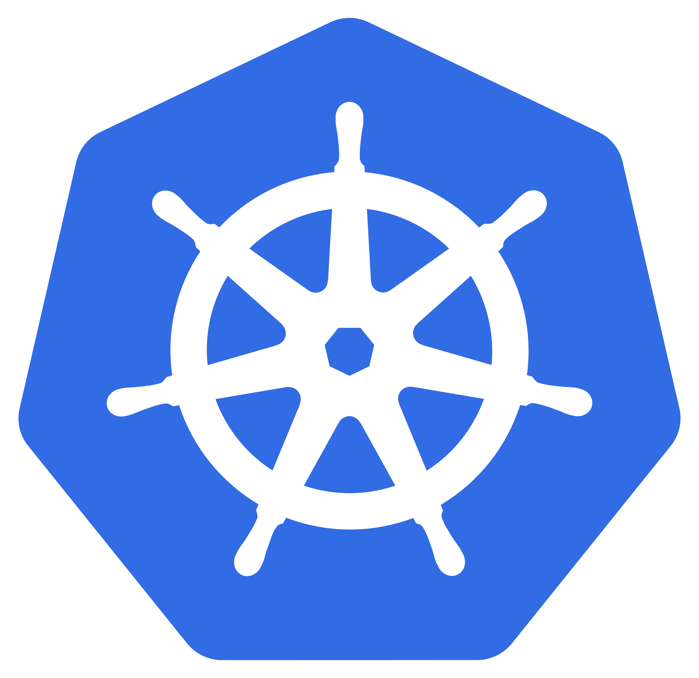

<!-- jump_to_middle -->
<!-- font_size: 2 -->
The Evolution of Architecture
===

<!--
speaker_note: |
  - Architectural background why Kubernetes came to be
-->

<!-- end_slide -->
Modular Monoliths
===

<!--
speaker_note: |
  - De-couple modules
  - Cannot be deployed individually
-->

<!-- end_slide -->
Microservices
===

<!--
speaker_note: |
  - Microservices
  - Does not improve decoupling
  - Independent deployment
  - Every service owner of its data
  - Communication via REST
  - Complex deployment orchestration needed
-->

<!-- end_slide -->
Kubernetes
===

<!--
speaker_note: |
  - Largest ecosystem in the world
  - Automates close to everything around infrastructure
  - Maybe a short super high-level primer on Kubernetes?
-->

<!-- end_slide -->
Kubernetes Shortcomings
===

<!-- column_layout: [1, 1] -->
<!-- column: 0 -->

## Compute Density

- Most containers contain OS
- REST servers everywhere
- Resource requests difficult

<!-- column: 1 -->

## Security

- Most containers contain OS
- Open by default

## Complexity

- AppDev needs knowhow
- No communication standard

<!-- reset_layout -->

<!--
speaker_note: |
  - ...
  - Is there a better way?
-->

<!-- end_slide -->
<!-- jump_to_middle -->
<!-- font_size: 2 -->
WebAssembly
===

<!--
speaker_note: |
  - What is it?
  - Lightweight, secure runtime
-->

<!-- end_slide -->
wasmCloud
===

<!--
speaker_note: |
  - Modules contain only their own code
  - Can be independently deployed
  - Communication standardized and via wRPC
  - A way to split a modular monolith onto different hosts
  - Can be multi-lingual
  - ...
-->

<!-- end_slide -->
TODO: slightly deeper dive into wasmCloud components
===

<!-- end_slide -->
TODO: demo
===

<!-- end_slide -->
TODO: introduction to hands-on
===
